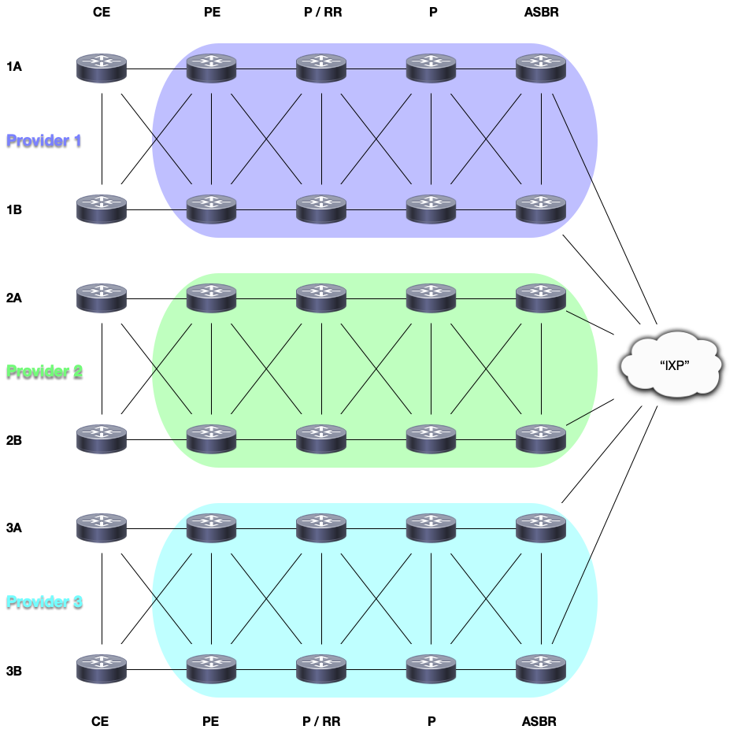

## ESXi Network Lab Generator

This script automates the generation and deployment of network operating
systems (NOS) labs on the VMware ESXi hypervisor. NOS platforms and labs
are defined in YAML files, and lab nodes are configured with Jinja2
templates. IP and IPv6 addressing for loopbacks and point-to-point links
are generated automatically. This script can optionally generate an iTerm2
dynamic profile for macOS to easily access the serial console of your
lab nodes.

### _Motivation:_

While there are other hypervisors available which are geared toward
networking labs (such as EVE-NG and GNS3), I found their performance 
to be sub-par when running larger or newer (DPDK-based) VMs inside a
nested environment. For example, Cisco's CSR1000v running inside
an EVE-NG VM running on an ESXi server is quite a bit more
resource-intensive than running it directly on the ESXi server.
That is to say, the performance is probably much better when running 
something like EVE-NG baremetal, but I did not want to dedicate a server 
solely to EVE-NG, which led to the creation of this project.

I am working with larger topologies (30+ nodes) and writing this
code to automatically generate the virtual infrastructure and base
IPv4 and IPv6 addressing saves me a lot of time and repetitive work.
I realize this script serves a somewhat niche use case, but it
provided me both a learning experience, and a public demonstration
of the Python experience I've gained up to this point.

### _Features:_

* Automatically create lab VMs by cloning existing base VMs
* Automatically generate ESXi port groups to function as point-to-point
links between lab nodes
* Automatically generate base IPv4 and IPv6 address scheme based on
node interconnections
* Option to actually deploy lab to ESXi server, or just output a
configuration script
* Option to generate and push lab node configurations after they have
been instantiated, or just output the configuration script for each
node (this script can be used simply to generate lab configurations
without requiring a push to an ESXi server or the lab nodes)  
* Option to generate an iTerm2 dynamic profile for macOS to easily
access the telnet serial console ports  
* Option to destroy and cleanup the lab from ESXi server when you are
finished

### _Requirements:_

Coded in Python 3.9 (should work with 3.6+) using the following
external libraries:
* paramiko
* Jinja2
* netaddr
* PyYAML

### _Usage:_

The script entrypoint is `esxi_netlab.py`. You must at a minimum
specify the lab YAML file to use with the `-n labfile.yaml` flag. You
can specify just the `-h` flag to list all the options.

To use the ESXi deployment options (the primary use case for this script),
you must copy the included `esxi_thinclone.sh` shell script to the
datastore on your ESXi server that is defined in your lab YAML file. In
the included example lab file `3xSP-Lab1-full.yaml`, this is specified
in the `datastore` key as `NVMe-1TB`. So in this case, you would copy the
shell script to the ESXi server at the location
`/vmfs/volumes/NVMe-1TB/esxi_thinclone.sh`.

##### ESXi VMs and the `platform_definitions.yaml` File

You will need to create your base lab VMs on the ESXi server and define
their relevant properties inside the `platform_definitions.yaml` file.
For each base VM, you must specify:
* The abbreviated (single-word) name which you will use to reference
the VM as the `platform` within your lab YAML file  
* The ESXi folder name (which is the VM name when you first create it)
* The serial console telnet port number defined in the VM
* The internal names of up to 10 interfaces

The included `platform_definitions.yaml` file includes interface naming
examples for a few different platforms. ESXi allows a maximum of 10 vNICs
to be specified in a VM, and some NOS platforms use certain interfaces
for management or internal purposes. You can exclude these interfaces
from neighbor and IP usage by leaving their values blank.

When you create a VM on your ESXi server, you should create a network
serial port or certain commands will fail when the script is executed.
When creating your VM, click `Add Other Device > Add Serial Port`.
Select the option `Use network`, direction `Server`, and the `Port URI`
as `telnet://:10700`, replacing `10700` with a value between
1025 - 65534. This value will be overwritten with what is specified
in the lab YAML file.

For your base VM, you also need to put all of your vNICs into the same
port group on the same vSwitch. It does not matter which one (it can be
the default), but they must all be the same. This value is specified
in the lab YAML file and will be overwritten when the lab is deployed
to the ESXi server. Your base VMs must also all reside on the same
datastore, which is also specified in the lab YAML file.

Though not required, it is recommended to boot your base lab VM, make
sure you can access the telnet serial console (e.g. `telnet ESXi-SERVER
PORT`), and optionally make foundational configurations that would
apply across all your labs (for example, an unlimited console session
timeout or disabling DNS lookups). Finally, once you have your base
VM set up how you want, it is recommended to unregister the VM from 
your ESXi inventory (but don't delete it!).

##### The Lab YAML File

This script requires the lab YAML file to work. An example file
`3xSP-Lab1-full.yaml` has been included to show the required format.
When you execute this script, the `validate_nodes.py` module will
read and validate both your lab file and the `platform_definitions.yaml`
file to look for mistakes.

Common lab settings are placed in the `lab_options` dictionary. This
includes:
* The lab name, which is used in various parts of the configuration output
* The IP or DNS address of the ESXi server
* The username used to log into ESXi (must have appropriate privileges to
add/remove port groups, copy files, execute shell scripts, register/
unregister VMs)
* Telnet port base multiplier (value between 2 - 65) which is used
with the lab node number to generate the telnet serial console port number
* The ESXi datastore name that all the base platform VMs reside on
* The ESXi vSwitch configured on all the base platform VMs
* The ESXi port group that all the base platform VM vNICs are assign to

Finally, the individual nodes are defined under the `nodes` dictionary.
* Nodes are defined by number, from `1 - 254`. The forming of point-to-point
neighbor links and base IP address generation is based on the node number.
* The `platform` corresponds to the abbreviation in the
`platform_definitions.yaml` file. 
* The `site` value is used as part of the IP address generation algorithm.
* The node neighbors are specified as a list. Even if the node has just
a single neighbor, it must still be defined in brackets. Up to 10 neighbors
can be defined for each node, depending on how many vNICs are actually 
usable. For example, the Cisco XRv9000 platform reserves 3 interfaces, so
you can have a maximum of 7 neighbors with that platform. You can create
multiple connections to the same neighbor by repeating the node number.  

Different parts of the script (and associated lab Jinja2 templates) are
written to accommodate certain variations based on the platform name.
Using Cisco as an example, some things are slightly different between
the IOS and IOS-XR platforms, such as requiring IP addresses to be
entered with a subnet mask. This script, as currently written, accounts
for this behavior.

One item that has not yet been addressed is how to handle nodes that
require deployment of multiple VMs which act as a single node, such as
more-recent versions of the Juniper vMX platform. As the script is
currently written, you will need to specify the multiple VMs as regular
neighbors which means wasting both a node number and IP address space.
However, this script, as currently written, supports up to 254 nodes.

##### Script Execution Options

You can display the script options by executing `python esxi_netlab.py -h`.

* For the script to do anything meaningful, you must always specify
the node YAML file with the `-n LAB.yaml` flag. This is the only
required flag.
* By default, the script does not generate any output files. You can
enable this with the `-o` flag, which will create an `output` folder and
place the ESXi configuration script, a CSV file of lab node interfaces
and their associated IP addresses, and the configuration files generated
by the Jinja2 template. 
* Use the `-it` flag to generate (and place) an iTerm2 dynamic profile.
This only works for macOS, but currently does not prevent you from
running it if you are on another platform. You can use this flag by
itself if you desire.
* Use the `-ip` flag (with the `-o` flag) to create a standalone CSV
file of the lab node interfaces and their associated IP addresses. This
flag is useful if you just want auto-generated IP addresses and nothing more.
* The `-ec` flag (with the `-o` flag) generates an output script of
commands that you can run from an SSH session with the ESXi server to
instantiate the lab manually. Lab removal commands are also generated.
* The `-ed` flag generates the ESXi lab infrastructure, logs into the
server specified in the lab YAML file, and instantiates the lab.
* The `-p` flag is used with `-ed` to power on the lab VMs after the
infrastructure is instantiated.
* Use the `-er` flag to automatically power off and remove the lab VM
infrastructure, including created port groups. This will clean up your
lab from the server when you are finished with it.
* The `-nc LAB-CONFIG.j2` flag is used to create the individual lab node
configurations. Use with the `-o` flag to create configuration files. Use
with the `-pc` flag to push the configurations to the lab nodes.

If you want to generate a full lab and deploy it, the full set of flags
would be: `python esxi_netlab.py -n 3xSP-Lab1-full.yaml 
-nc 3xSP-Lab1-base-config.j2 -ed -p -pc`. When you're done with the lab,
destroy it with `python esxi_netlab.py -n 3xSP-Lab1-full.yaml -er`

###### **IMPORTANT:**
* You MUST copy the `esxi_thinclone.sh` file to the ESXi datastore that
contains your base lab platform VMs
* If you are pushing the generated lab node configurations with the `-pc`
flag, you must ensure all of your lab nodes are fully booted first and
ready to accept configuration commands.
* The `-it` flag is for macOS iTerm2 only. If you are not running macOS
and iTerm2, don't use this flag.

### _Even More Information!_

Right now, the script only accepts a single Jinja2 template to generate
the configuration for all nodes. One way that you can account for completely
separate network operating systems within the single file is to reference
the platform within a ``
stanza. Don't forget to close it with ``. Place all configurations
specific to that particular platform within that stanza. The included J2
file demonstrates accounting for some configuration differences between
IOS and IOS-XR.

The `config_deploy.py` module will need to be customized if you are using
platforms other than IOS/XE or IOS-XR. This module contains platform-specific
commands to be run via the telnet serial console ports.

The `config_render.py` module will convert IPv4 address CIDR format to
the IP and subnet mask if `ios` is anywhere in the platform name. So
`172.16.30.1/24` becomes `172.16.30.1 255.255.255.0`.

The `iterm2_profile.py` module contains two variable constants. One
references the J2 template `iterm2.j2`, and the other specifies the
location where the generated profile will go (currently the iTerm2
dynamic profile folder). 

The `validate_nodes.py` module is one of the most important parts of
the script. This file is heavily-commented and checks both the
`platform_definitions.yaml` and lab YAML files to make sure all options
are present and within defined constraints. If anything is incorrect,
the script will crash with an error message relating to the issue. My
approach to creating this script was to perform as much validation as
possible up front so that I would have to account for fewer exceptions
later in the code.

Finally, the `ip_generate.py` module completes the network lab base
automation by generating IPv4 and IPv6 addresses automatically based
on the lab node numbers and sites. IPv4 interface addresses use a /24 mask
so that the final octet can be the node number for easy reference.

- Loopbacks:
  - 192.168._site.device_/32  (192.168 configurable, must be /16)
  - fd00:_site_::_device_/128
- Physical inter-neighbor interfaces:
  - 10._lower.higher.device_/24
  - fd00:_lower:higher_::_device_/64

The node _lower.higher_ addressing is used so that the IP generation is
deterministic. Neighbors with multiple connections are handled by using
a configurable /16 (172.30 as currently set) with an incrementing counter
of 1 - 254 for each link, meaning there can be a total of up to 254
multi-links across the entire lab.

As mentioned, a major issue that is not yet accounted for in this script
is the situation involving multiple nodes acting as a single point of
management, such as the case with Juniper's vMX router using separate
VCP and VFP VMs. Until this logic is worked out in the code, the
alternative is to use a single-VM version of your desired NOS, or
integrate those VMs into the lab manually after deployment.

And of course, one of the best ways to try to understand what is going on
is to look at the code itself. I have commented most sections of the code.
There are several lab situations I have not accounted for, but this is
meant to be a starting point, and a way to quickly generate base labs
so that we can get to the good stuff!

### _Updates_

* 2020-03-31: Added a couple additional platforms to some files
and updated the ESXi port group creation function to include an
incrementing VLAN for each PG for true Layer 2 separation  